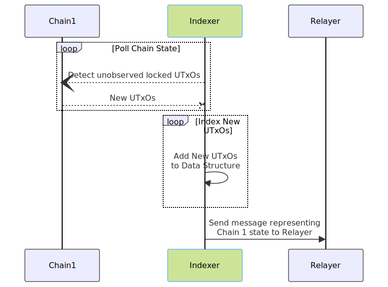
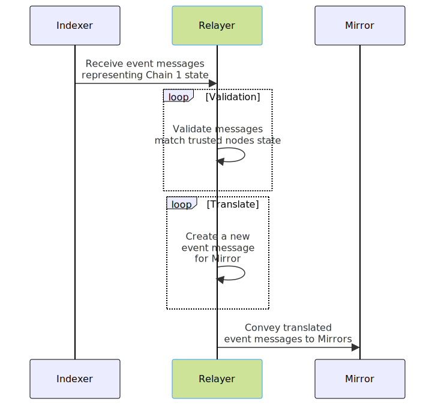

# VISTA Protocol Design Documentation

Detailed documentation outlining the vision for the VISTA protocol design and architecture, as well as laying the groundwork for the development roadmap to help the team accomplish the mission.

## Modules
1. [Cardano Indexer](#cardano-indexer)
2. [Cardano Mirror](#cardano-mirror)
3. [Cardano Relayer](#cardano-relayer)

## Cardano Indexer

The `Cardano Indexer`, AKA the "Watcher", is a set of components which securely observe the Cardano blockchain and initiate consequent actions.

### Purpose

1. Observe a Cardano-based blockchain smart contract address.
2. Detect verified deposits to the smart contract.
3. Create a deterministic, indexed data structure to prepare the locked asset(s) for bridging.
4. Send messages to `Relayers` as new records are indexed.

## Cardano Mirror

The `Cardano Mirror` reflects the changes seen by the Observing Indexer onto the destination chain. 

### Purpose
1. Receive a message payload from a `Relayer`.
2. Create transactions on a Cardano Blockchain.

## Cardano Relayer

The Cardano Relayer andles communication between `Indexers` and `Mirrors`. 

### Purpose

1. Listen for event messages from `Indexers`.
2. Issue event messages to `Mirrors`.

